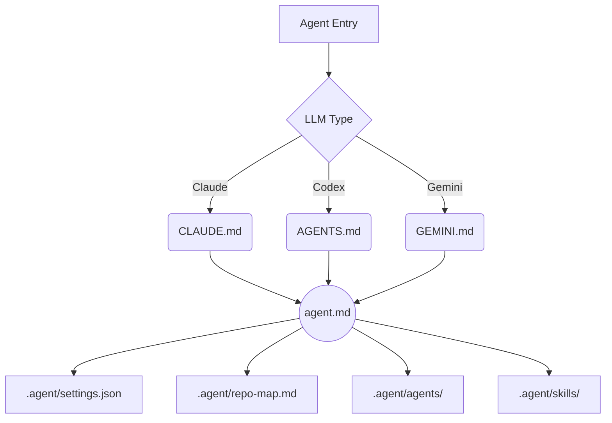

  <h1>🤖 Agent Coder Harness</h1>
  
<strong>The ultimate multi-LLM boilerplate for AI Agents (Claude Code, Codex, Gemini, Cursor).</strong>

  
Maximize token efficiency, prevent context bloat, and enforce structural workflows via progressive disclosure.

  
  

---

## 🚀 Overview
**Agent Coder Harness** is a highly SEO-optimized, universal coding boilerplate designed to be dropped into any new or existing software project. 

If you are using **AI Coding Agents** like Claude, Codex, Gemini, or tools like Cursor, this harness structurally forces them to operate with **maximum token efficiency** and adopt specialized engineering personas ("The Critic Fleet").

### ✨ Key Features
- **Token Optimization Strategy**: Hard-coded constraints in `.agent/settings.json` prevent agents from reading expensive, bloated directories (e.g., `node_modules/`, `dist/`).
- **Memory Agent Skills (`handoff`/`pickup`)**: Pause long agentic coding sessions and resume them perfectly without losing context or wasting tokens on re-reading history.
- **Progressive Disclosure**: Agents start at a tiny root file and are dynamically routed to only the context they need, keeping prompts surgical and focused.
- **The Critic Fleet**: Specialized AI Personas built-in (e.g., `ui-ux-designer`, `stack-architect`, `db-verify`) to enforce clean code and DRY principles.
- **Multi-LLM Universality**: Zero-config entry points out of the box for `CLAUDE.md`, `AGENTS.md`, and `GEMINI.md`.

---

## 🏗️ Architecture

## 📂 Project Structure
- `agent.md`: The central entry point router for the AI.
- `CLAUDE.md`, `AGENTS.md`, `GEMINI.md`: Zero-config entry points that each LLM natively discovers.
- `.agent/settings.json`: Hard limits and read denials to prevent context bloat.
- `.agent/repo-map.md`: Architectural map to prevent blind glob searches.
- `.agent/hooks.json`: Definitions of pre/post execution hooks.
- `.agent/agents/`: Role definitions for the AI (The Critic Fleet).
- `.agent/skills/`: Executable workflows, memory state (`handoff`/`pickup`), and token-efficiency rules.
- `.agent/hooks/`: Bash validation scripts (e.g., `verify-loop.sh`) and PowerShell support.
- `.agent/templates/`: Reusable templates for Specs and ADRs.

## 🛠️ Quickstart

1. **Clone or Drop** this repository into your project root.
2. **Point your Agent**: Each LLM auto-discovers its own entry file (`CLAUDE.md`, `AGENTS.md`, or `GEMINI.md`) — no manual instruction needed.
3. **Customize**: Edit `.agent/repo-map.md` to reflect your actual project architecture.
4. **Code!** Watch your token costs plummet while code quality skyrockets.

---

## 👨‍💻 About the Author
Created with precision by **Ammar Qwaider**. 
